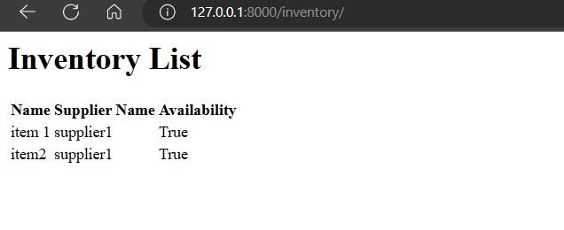
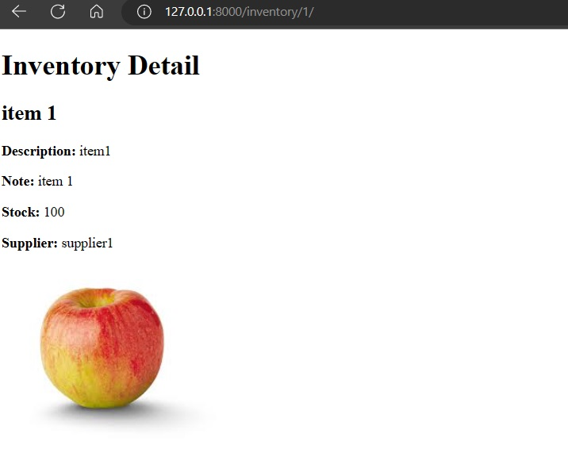
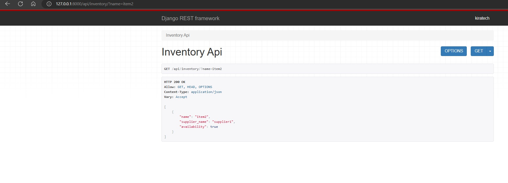
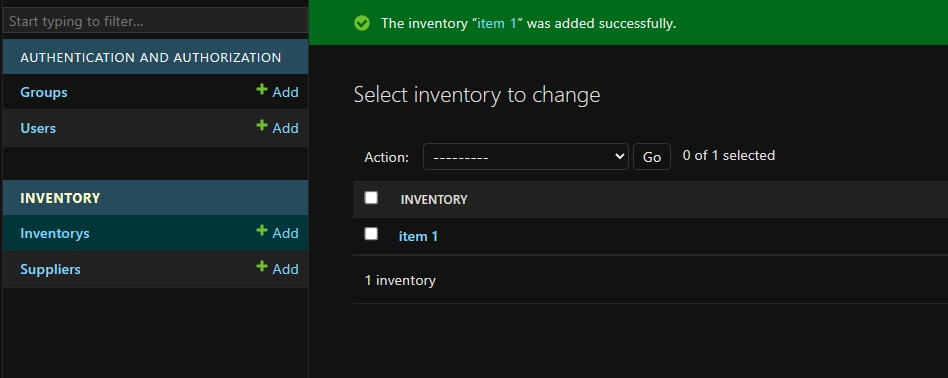
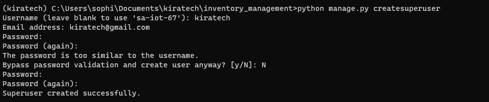

## Cloning and starting project
Install Python and Django (preferably with Python Virtual Environment)
1. - git clone https://github.com/avant10/Django-inventory
2. - cd Django-Inventory
3. - pip install -r requirements.txt
4. - python manage.py runserver

List

/inventory/{id}  View

/api/inventory/{id}  API

Admin

Superuser

